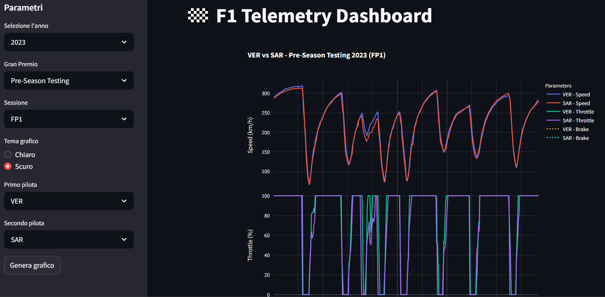

# 🏎️ F1 Telemetry Dashboard

Un'app interattiva per confrontare la telemetria di due piloti di Formula 1 sul giro più veloce, basata sui dati ufficiali forniti da [FastF1](https://theoehrly.github.io/Fast-F1/).

## 📸 Anteprima



## ⚙️ Funzionalità

- Selezione anno, circuito e sessione (prove libere, qualifiche, gara)
- Scelta dinamica dei piloti disponibili
- Grafici interattivi sincronizzati:
  - Velocità
  - Throttle (acceleratore)
  - Brake (frenata)
- Griglia su asse X (distanza) per migliorare il confronto
- Tema chiaro/scuro selezionabile
- Responsive e usabile da desktop e mobile

## 🚀 Come eseguirlo localmente

### 1. Clona il progetto

```bash
git clone https://github.com/tuo-username/f1-telemetry-dashboard.git
cd f1-telemetry-dashboard
```

### 2. Installa le dipendenze

Si consiglia l'uso di un virtual environment.

```bash
pip install -r requirements.txt
```

### 3. Avvia l'app

```bash
streamlit run ./src/app.py
```
